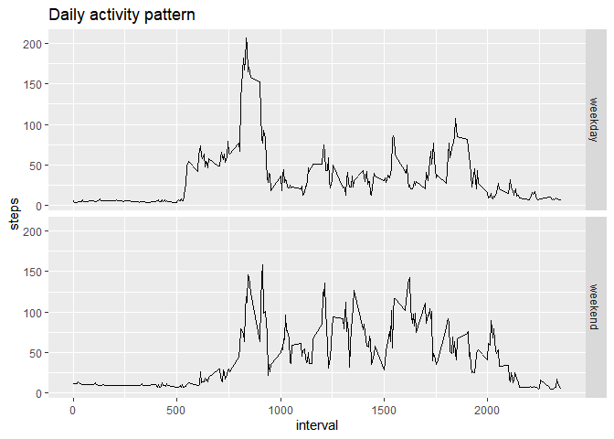

## Loading and preprocessing the data

```r
library(plyr)
library(dplyr)
library(tidyr)
library(lemon)
knit_print.tbl <- lemon_print
```

```r
#reading the raw data
activity = read.csv(unz("activity.zip","activity.csv"), stringsAsFactors = FALSE)
#processing data
activity$date = as.Date(activity$date)
activity = as_tibble(activity)
head(activity)
```


 steps  date          interval
------  -----------  ---------
    NA  2012-10-01           0
    NA  2012-10-01           5
    NA  2012-10-01          10
    NA  2012-10-01          15
    NA  2012-10-01          20
    NA  2012-10-01          25


## What is mean total number of steps taken per day?


```r
#Calculating mean steps per day
activity_per_day = activity %>% group_by(date) %>% summarise(steps = sum(steps,na.rm= TRUE))
#Creating histogram
hist(activity_per_day$steps,breaks= 10, main = "Steps per day", xlab = "Steps", ylab = "Days")
```

<!-- -->

```r
#Calculating mean and median of steps per day.
mean_steps = mean(activity_per_day$steps,na.rm = TRUE)
median_steps = median(activity_per_day$steps, na.rm = TRUE)
```
The mean is 9354.23 and the median is 10395.


## What is the average daily activity pattern?

```r
#Calculating the mean steps per interval
activity_per_interval = activity %>% group_by(interval) %>% summarise(steps=mean(steps,na.rm=TRUE))
#Plotting the daily activity pattern
plot(activity_per_interval, type = "l", main  = "Daily Activity Pattern",ylab = "Average steps per interval")
```

<!-- -->

```r
#Calculating the interval with the greatest average steps.
max_steps_interval = activity_per_interval[which.max(activity_per_interval$steps),]$interval
max_avg_steps  = filter(activity_per_interval, interval == max_steps_interval)$steps
```
The time interval with highest average steps is the interval from 835 to 839 with an average of 206.1698113 steps.

## Imputing missing values


```r
#Calculating the number of NA's
na_number = sum(is.na(activity$steps))
#function to select mean steps per interval for each NA value.
f = function(x){
    if (is.na(x$steps)){
    x$steps = activity_per_interval$steps[activity_per_interval$interval == x$interval]
    }
}
#Replacing missing values with the mean steps per interval.
applied = ddply(activity,.(steps, interval, date),f)
activity_filled = mutate(activity, steps = replace(activity$steps,which(is.na(activity$steps)),applied$V1))
#calculating the average steps per day.
activity_per_day2 = activity_filled %>% group_by(date) %>% summarise(steps = sum(steps))
#Creating the histogram.
hist(activity_per_day2$steps,breaks= 10,main = "Steps per day",xlab = "Steps", ylab = "Days")
```

<!-- -->

```r
#Recalculating the mean and median.
new_mean_steps = mean(activity_per_day2$steps)
new_median_steps = median(activity_per_day2$steps)
```

The total number of NA in the data is 2304. Those values were replaced by the mean steps per interval.
The mean steps per day calculated with the NA filled is 10766.19 and the median is 11015.0.
The mean and the median are higher than before filling the NA's as the new values increase the steps count for some of the days. 

## Are there differences in activity patterns between weekdays and weekends?


```r
#function to select if the day is part of the weekend or its a weekday.
part_of_week = function(a_date){
                  if (weekdays(a_date) %in% c("domingo","sábado")){
                          part = "weekend"
                  }
                  else{
                          part = "weekday"
                  part
                  }
               }
# Creating the variable weekpart as a factor with two possible values: weekend and weekday
activity_filled = activity_filled %>% rowwise() %>% mutate(weekpart = part_of_week(date))
activity_filled$weekpart = as.factor(activity_filled$weekpart)
#summarising the data by interval and weekpart
activity_f_by_interval  = activity_filled %>% group_by(interval,weekpart) %>%summarise(steps = mean(steps))
# Creating the plot
library(ggplot2)
qplot(interval, steps, data = activity_f_by_interval, geom = "line",facets= weekpart~., main = "Daily activity pattern")
```

<!-- -->

