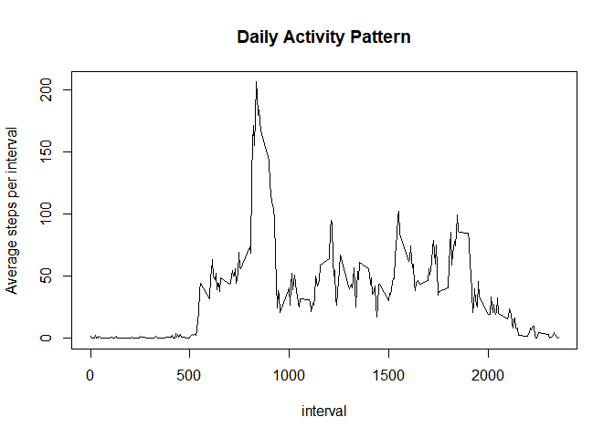

#Activity Monitoring Data

The data contained in this dataset comes from a personal activity monitoring device.The data consists of two months of data from an anonymous individual and include the number of steps taken in 5 minute intervals each day.

## Loading and preprocessing the data
Loading the packages

```r
library(plyr)
library(dplyr)
library(tidyr)
library(lemon)
library(ggplot2)
knit_print.tbl <- lemon_print
```

Loading the data into the `activity` dataframe.

```r
#reading the raw data
activity = read.csv(unz("activity.zip","activity.csv"), stringsAsFactors = FALSE)
#pre-processing data
activity$date = as.Date(activity$date)
activity = as_tibble(activity)
head(activity)
```


 steps  date          interval
------  -----------  ---------
    NA  2012-10-01           0
    NA  2012-10-01           5
    NA  2012-10-01          10
    NA  2012-10-01          15
    NA  2012-10-01          20
    NA  2012-10-01          25


## What is the mean total number of steps taken per day?

In order to calculate this value, the number of steps per day are calculated for each date and added to the `activity_per_day` dataframe. Using this dataframe, the mean and median were calculated. 

```r
#Calculating number of steps per day
activity_per_day = activity %>% group_by(date) %>% summarise(steps = sum(steps,na.rm= TRUE))

#Calculating the mean and the median of steps per day.
mean_steps = mean(activity_per_day$steps,na.rm = TRUE)
median_steps = median(activity_per_day$steps, na.rm = TRUE)

#Creating histogram
hist(activity_per_day$steps,breaks= 20, main = "Steps per day", xlab = "Steps", ylab = "Days", col="grey")
abline(v=mean_steps,col="red", lw=3) #mean in red
abline(v=median_steps,col="blue",lw=3) #median in blue
```

<!-- -->


The mean steps per day,shown in red, is 9354.23 and the median is 10395, shown in blue.


## What is the average daily activity pattern?

The average daily activity pattern was calculated using the average number of steps in each time interval and plotting the result. Also, the time interval with the highest average of steps  was calculated.


```r
#Calculating the mean steps per interval
activity_per_interval = activity %>% group_by(interval) %>% summarise(steps=mean(steps,na.rm=TRUE))

#Plotting the daily activity pattern
plot(activity_per_interval, type = "l", main  = "Daily Activity Pattern",ylab = "Average steps per interval")
```

<!-- -->

```r
#Calculating the interval with the greatest average steps.
max_avg_steps = activity_per_interval%>%summarize(interval=interval[which.max(steps)],steps= max(steps)) 
```

The time interval with the highest average of steps  was found to be the interval from 835 to 839 with an average of 206.1698 steps.
 
 
## Inputing missing values

The number of NA values was calculated and then this values were replaced by the mean activity per interval and added to the `activity_per_day2` dataframe. Using this dataframe, the mean and the median were recalculated and a histogram of the number of steps per day was plotted.


```r
#Calculating the number of NA's
na_number = sum(is.na(activity$steps))
#function to select mean steps per interval for each NA value.
f = function(x){
    if (is.na(x$steps)){
        x$steps = activity_per_interval$steps[activity_per_interval$interval == x$interval]
    }
}
#Replacing missing values with the mean steps per interval.
applied = ddply(activity,.(steps, interval, date),f)
activity_filled = mutate(activity, steps = replace(activity$steps,which(is.na(activity$steps)),applied$V1))

#calculating the average steps per day.
activity_per_day2 = activity_filled %>% group_by(date) %>% summarise(steps = sum(steps))

#Recalculating the mean and median.
new_mean_steps = mean(activity_per_day2$steps)
new_median_steps = median(activity_per_day2$steps)

#Creating the histogram.
hist(activity_per_day2$steps,breaks= 20,main = "Steps per day",xlab = "Steps", ylab = "Days",col="grey")
abline(v=new_mean_steps,col="red", lw=3) #mean in red
abline(v=new_median_steps,col="blue",lw=3) #median in blue
```

<!-- -->


The total number of NA in the data is 2304. The mean steps per day, calculated with the NA filled is 10766.19 and is shown in red. The median is 11015.0 and is shown in blue. The mean and the median values are higher than before filling the NA's as the new inputted values increase the steps count for some of the days. 

## Are there differences in activity patterns between weekdays and weekends?

In order to check the difference in activity between weekdays and weekends, a new factor variable, weekpart, was created and the activity pattern was obtained for each factor(weekdays and weekends).


```r
#function to select if the day is part of the weekend or its a weekday.
part_of_week = function(a_date){
                  if (weekdays(a_date) %in% c("domingo","sábado")){
                          part = "weekend"
                  }
                  else{
                          part = "weekday"
                  }
                  part
               }
# Creating the variable weekpart as a factor with two possible values: weekend and weekday
activity_filled = activity_filled %>% rowwise() %>% mutate(weekpart = part_of_week(date))
activity_filled$weekpart = as.factor(activity_filled$weekpart)

#summarising the data by interval and weekpart
activity_f_by_interval  = activity_filled %>% group_by(interval,weekpart) %>%summarise(steps = mean(steps))

# Creating the plot
library(ggplot2)
qplot(interval, steps, data = activity_f_by_interval, geom = "line",facets= weekpart~., main = "Daily activity pattern")
```

<!-- -->

